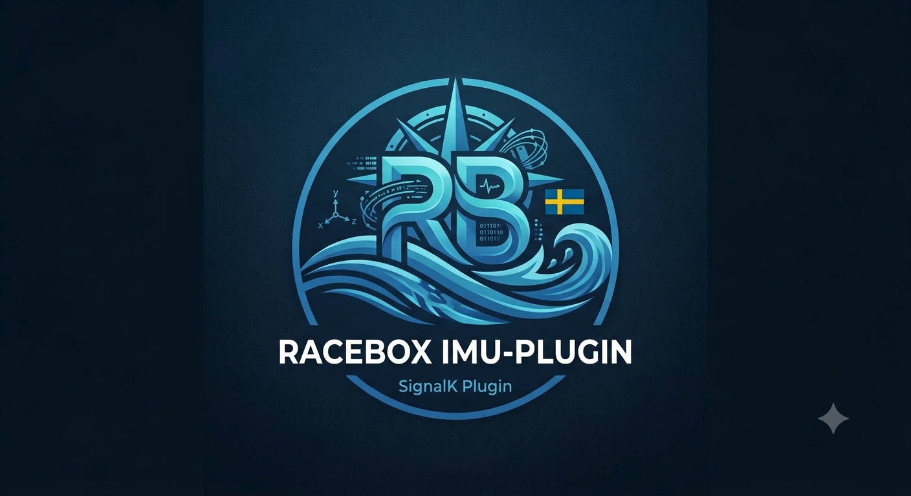
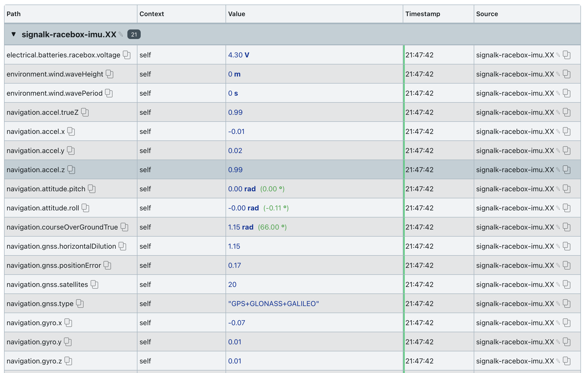
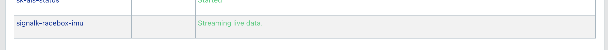

# signalk-racebox-imu

<p align="center">
  
</p>

A Signal K plugin to auto-discover, connect, and stream telemetry from a **RaceBox Mini**, **RaceBox Mini S**, or **RaceBox Micro** over Bluetooth Low Energy (BLE).

This plugin parses the RaceBox binary protocol (UBX-framed, per the official *RaceBox BLE Protocol Description rev 8*) and converts it into standard Signal K paths. Streams at 25Hz with full 6-axis IMU (accelerometer + gyroscope), GPS/GNSS position, course/speed, battery monitoring, and satellite tracking.

---

## Features
* **Zero Configuration Pairing:** Auto-discovers and connects to the first device advertising as "RaceBox".
* **Full Telemetry Mapping:** Position, SOG, COG, Pitch, Roll, satellite count, battery status, and GPS accuracy.
* **6-Axis IMU Streaming:** Raw accelerometer (X/Y/Z) and gyroscope (X/Y/Z) data at 25Hz.
* **Experimental Wave & Slam Detection:** Advanced math (True Z rotation + leaky integration) to estimate wave height, period, and detect hull slams from the 6-axis IMU.
* **Fix-Aware Position Gating:** Navigation data is only published with a valid GNSS fix.
* **In-App Calibration:** Zero out Pitch & Roll offsets while the boat is level.
* **Self-Healing Connection:** Automatic reconnect with backoff and data-staleness watchdog.
* **High-Quality Codebase:** Decoupled metadata and automated unit tests for reliability.

---

## Screenshots

### Plugin Configuration & Experimental Settings


### Live Data Stream (25Hz)


### Connection Status


---

## Prerequisites & System Dependencies

The plugin uses the standard Linux Bluetooth stack (BlueZ) via D-Bus.

### 1. Ensure BlueZ is installed and running
```bash
sudo apt-get install bluetooth bluez
sudo systemctl enable --now bluetooth
bluetoothctl power on
```

### 2. Grant D-Bus permission
Create `/etc/dbus-1/system.d/signalk-ble.conf`:
```xml
<!DOCTYPE busconfig PUBLIC "-//freedesktop//DTD D-BUS Bus Configuration 1.0//EN"
  "http://www.freedesktop.org/standards/dbus/1.0/busconfig.dtd">
<busconfig>
  <policy user="theseal666">
    <allow own="org.bluez"/>
    <allow send_destination="org.bluez"/>
    <allow send_interface="org.bluez.GattCharacteristic1"/>
    <allow send_interface="org.bluez.GattDescriptor1"/>
    <allow send_interface="org.freedesktop.DBus.ObjectManager"/>
    <allow send_interface="org.freedesktop.DBus.Properties"/>
  </policy>
</busconfig>
```
Reload D-Bus: `sudo systemctl reload dbus`.

---

## Installation

### Method 1: Via Signal K App Store (Recommended)
1. Search for `signalk-racebox-imu` in **Appstore → Available**.
2. Install and restart Signal K.

### Method 2: Manual Installation
```bash
cd ~/.signalk
npm install github:theseal666/signalk-racebox-imu#feature/quality-improvements
sudo systemctl restart signalk
```

---

## Configuration

1. **Experimental Features:** Enable "EXPERIMENTAL: Enable Wave Height & Period detection" in settings.
2. **Calibration:** Check "CALIBRATE IMU" while the boat is level and floating naturally.
3. **Bluetooth Reset:** Use "RESET BLUETOOTH" to clear system-level connection lockups.

---

## Signal K Paths Emitted

### Navigation – Waves & Performance (Experimental)
* `navigation.accel.trueZ` — Earth-fixed vertical acceleration (g)
* `environment.wind.waveHeight` — Estimated peak-to-peak wave height (m)
* `environment.wind.wavePeriod` — Estimated wave period (s)
* `performance.hull.slamAcceleration` — Peak vertical impact acceleration (g)

**Note:** When experimental features are enabled, these paths are persistently reported at 25Hz. If no waves are detected for 20 seconds, the values will automatically reset to `0` to ensure clean logging in tools like Expedition. Slam acceleration resets to `0` after a 1-second peak-hold.

### Navigation – Core
* `navigation.attitude.{roll, pitch}` — Calibrated orientation
* `navigation.position`, `navigation.speedOverGround`, `navigation.courseOverGroundTrue`
* `navigation.accel.{x, y, z}`, `navigation.gyro.{x, y, z}` (Raw 25Hz)

---

## Development & Testing

This plugin includes an automated test suite to verify the parser logic without needing a physical device.

```bash
# Run tests
npm test
```

To test with a live device, clone the repo and link it:
```bash
npm install https://github.com/theseal666/signalk-racebox-imu.git#feature/quality-improvements
```

---

## License
MIT License.
